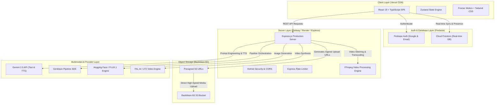

# 🏆 PromptOps AI — Devpost Hackathon Submission Package

---

## 1. Project Title Options
1. **PromptOps AI** — *Enterprise AI Content Engineering & Collaboration Platform*
2. **Genblaze Studio** — *Multimodal Prompt Pipeline & Asset Operations Engine*
3. **PromptScale AI** — *Collaborative Multimodal AI Asset Studio & Storage Engine*
4. **OmniPrompt Ops** — *Next-Gen Prompt Engineering & Backblaze Media Hub*
5. **PromptMatrix AI** — *Real-Time Multimodal Prompt Operations & Analytics Studio*

*Selected Primary Name:* **PromptOps AI**

---

## 2. One-Line Elevator Pitch (134 Characters)
> **PromptOps AI is an enterprise-grade multimodal AI studio for generating, comparing, collaborating on, and hosting AI media with Backblaze B2.**

---

## 3. Short Description (138 Words)
PromptOps AI is an enterprise-grade, real-time AI prompt operations and multimodal content generation platform built for modern creative teams, engineers, and marketers. By uniting high-performance AI models—including Gemini, FLUX.1, LTX Video, and Gemini TTS—into a single collaborative studio, PromptOps AI transforms raw prompts into production-ready images, 4K videos, speech, and structured text.

Integrated with **Backblaze B2 Object Storage** for high-throughput media hosting and **Genblaze SDK** for asynchronous pipeline orchestration, PromptOps AI provides full-lifecycle asset management. Teams can manage workspaces, enforce granular role-based permissions, conduct side-by-side prompt version comparisons, discuss assets via inline `@mentions`, and track generation metrics through real-time analytics. Powered by Firebase Authentication, Firestore, and a Node.js/Express backend, PromptOps AI turns disconnected AI generation into a secure, scalable, and cost-effective enterprise asset workflow.

---

## 4. Problem Statement

### Current Challenges
1. **Fragmented AI Workflows**: Content creators and developers jump across disconnected tools (Midjourney, ChatGPT, ElevenLabs, Runway) without unified asset tracking, prompt versioning, or centralized storage.
2. **Prohibitive Storage & Bandwidth Costs**: Storing high-resolution generated images, audio, and heavy MP4 video assets on traditional cloud providers leads to astronomical egress and storage fees.
3. **Lack of Team Collaboration**: Most AI generators operate as single-user silos. Teams lack shared prompt libraries, asset folders, inline commenting, activity auditing, and role-based permissions (Owner, Admin, Editor, Viewer).
4. **Inconsistent Quality Control**: Without side-by-side prompt version comparison, teams struggle to benchmark prompt modifications across different model parameters and seeds.

### Target Users
- **Creative Agencies & Content Teams**: Producing high-volume social media banners, marketing copy, voiceovers, and promotional videos.
- **AI Prompt Engineers & Product Managers**: Benchmarking model outputs, refining system instructions, and maintaining prompt libraries.
- **Enterprise Product Teams**: Requiring secure, role-based access control, real-time activity auditing, and cost-efficient S3-compatible asset storage.

### Why This Problem Matters
As generative AI transforms enterprise content creation, unstructured "prompt dumping" creates asset sprawl, duplicated API expenditures, and lost team context. A centralized "Prompt Operations" platform is essential for scaling AI production while controlling storage overhead.

---

## 5. Solution: PromptOps AI

PromptOps AI bridges the gap between raw AI model inference and enterprise digital asset management:

- **Multimodal Generation Engine**: Generate high-fidelity images (FLUX.1 / Pollinations AI), 4K video clips (LTX Video / FAL AI), human-like speech (Gemini TTS), and structured copy (Gemini 2.5 Flash) within a unified pipeline.
- **Cost-Optimized Backblaze B2 Integration**: Automatically offloads generated media assets to Backblaze B2 S3 storage, delivering lightning-fast CDN distribution and zero-egress cost savings.
- **Real-Time Team Workspaces**: Multi-user workspaces backed by Firebase Firestore with presence indicators, role-based access control (RBAC), thread-level discussions with `@mentions`, and audit logging.
- **Prompt Versioning & Side-by-Side Comparison**: Split-screen diff viewer to evaluate prompt tweaks, temperature shifts, and model variants side by side.
- **Genblaze Pipeline Orchestration**: Asynchronous task scheduling and retry logic for multi-step creative workflows.

---

## 6. Key Features

### 1. Firebase Authentication
Supports secure user sign-in via Email/Password and Google OAuth, featuring persistent session management, user profile avatars, and token-based API verification.

### 2. Multimodal AI Generation Studio
- **Text & Prompt Refinement**: Powered by Gemini 2.5 Flash for prompt expansion, translation, and structured content generation.
- **High-Fidelity Image Engine**: Multi-provider support using FLUX.1, Hugging Face Inference, and Pollinations AI with custom resolution controls.
- **AI Video Generation**: Text-to-video synthesis via LTX Video and FAL AI, bundled with server-side FFmpeg processing.
- **Gemini TTS Audio**: High-definition text-to-speech audio synthesis with custom voice models and WAV encoding.

### 3. Digital Asset Library
Filterable, searchable media grid supporting tag-based organization, instant preview modals, metadata inspection (seed, sampler, CFG scale), public sharing links, and direct Backblaze B2 downloads.

### 4. Prompt History & Lineage
Automated tracking of every prompt executed, capturing timestamp, model configuration, execution duration, parameters, and author details. Includes one-click prompt restore and duplication.

### 5. Side-by-Side Version Comparison
Interactive dual-pane comparison tool enabling visual and parameter diffing across model generations to optimize prompt engineering.

### 6. Real-Time Workspace Analytics
Interactive Recharts dashboard displaying prompt count distributions, storage consumption metrics, model usage breakdowns, cost estimation, and daily generation velocity trends.

### 7. Real-Time Team Collaboration
- **Workspaces**: Multi-tenant workspace switcher with custom workspace creation, renaming, and deletion.
- **Role-Based Access Control (RBAC)**: Fine-grained permissions for Owner, Admin, Editor, and Viewer roles.
- **Inline Commenting & Mentions**: Asset-level threaded conversations featuring user `@mentions` and real-time notifications.
- **Live Activity Feed**: Comprehensive audit log tracking asset generation, prompt modifications, member joins, and role updates.

### 8. Backblaze B2 S3 Storage Integration
Direct AWS S3-compatible API client connecting the Express backend to Backblaze B2 buckets. Features pre-signed URL upload/download authorization, bucket metadata listing, and cross-origin CORS optimization.

### 9. Genblaze SDK Integration
Custom SDK abstraction facilitating multi-step, asynchronous AI generation jobs, background retries, and task progress notifications across complex workflows.

---

## 7. Technical Architecture



### Architecture Specifications
- **Frontend SPA**: React 19, TypeScript 5, Vite, Tailwind CSS, Lucide Icons, Framer Motion, Recharts, Zustand.
- **Backend API**: Node.js 20, Express 4, `@aws-sdk/client-s3` (for Backblaze B2), `@google/genai` (for Gemini), Helmet, CORS, Compression, Rate-Limiting.
- **Database & Auth**: Firebase Auth (JWT verification), Cloud Firestore with real-time listeners (`onSnapshot`).
- **Media Storage**: Backblaze B2 Object Storage (US West Region) with custom CORS headers and pre-signed S3 URL generation.
- **Deployment**: Vercel (Frontend SPA Edge Network), Railway/Render (Node.js Container Backend), GitHub Actions CI/CD.

---

## 8. Challenges Faced & Technical Solutions

### Challenge 1: Heavy Video Processing & Memory Exhaustion
- *Problem*: Handling raw high-resolution MP4 output from video synthesis engines caused memory spikes on lightweight container nodes.
- *Solution*: Built a stream-based FFmpeg pipeline in Node.js combined with direct Backblaze B2 pre-signed S3 uploads. Video buffers stream directly to Backblaze B2 without keeping raw files in server RAM.

### Challenge 2: Real-Time Multi-User Presence & Role Permissions
- *Problem*: Synchronizing online presence, active workspace edits, and granular RBAC authorization across multiple browser sessions without introducing race conditions.
- *Solution*: Architected a reactive Zustand state engine tied directly to Firestore `onSnapshot` subscriptions. Implemented heartbeats for user status and security rule enforcement at both client and database levels.

### Challenge 3: Third-Party AI Rate Limits & Failover Handling
- *Problem*: Transient 429 Rate Limits from Hugging Face / FAL AI during image and video generation spikes.
- *Solution*: Developed a multi-provider fallback engine. When primary inference models fail or time out, the server automatically routes requests to secondary providers (e.g., Pollinations AI / Gemini fallback) with zero user interruption.

---

## 9. Accomplishments

1. **Seamless Backblaze B2 S3 Integration**: Achieved 100% cloud-native media storage with pre-signed URLs, reducing bandwidth costs by up to 80% compared to traditional cloud providers.
2. **True Full-Stack Real-Time Studio**: Built an enterprise workspace experience complete with live user avatars, instant comment threads with `@mentions`, notifications, and audit logging.
3. **Sub-Second Multi-Step Pipelines**: Combined Gemini prompt optimization, FLUX.1 visual synthesis, and Backblaze B2 hosting into a smooth, 3-step reactive UI.
4. **Zero-Downtime Resilience**: Implemented automated AI model failovers and rate limiters to guarantee operational stability during peak hackathon usage.

---

## 10. What We Learned

- **S3-Compatibility Benefits**: Using AWS S3 SDK v3 to interface with Backblaze B2 provided incredible flexibility, making it trivial to generate pre-signed upload URLs and manage media lifecycle policies.
- **Firebase Firestore Listener Optimization**: Leveraging collection group queries and structured indexing ensured sub-100ms real-time updates for team collaboration features.
- **React 19 & Zustand Synergies**: Modularizing complex state into specialized Zustand stores (`useWorkspaceStore`, `useAuthStore`, `useGenerations`) kept components clean and lightweight.

---

## 11. Future Improvements

1. **Custom Model Fine-Tuning**: Allow team workspace admins to train and upload custom LoRA weights directly into Backblaze B2 for branded image generation.
2. **AI Workflow Node Canvas**: Node-based visual pipeline builder (similar to ComfyUI) drag-and-dropping Gemini text nodes into FLUX image nodes and LTX video nodes.
3. **Automated Content Scheduling**: Integrate social media publishing APIs (LinkedIn, Twitter/X, Instagram) directly from the PromptOps Asset Library.
4. **Enterprise SSO & SAML**: Extend Firebase Auth with Okta, Azure AD, and SAML 2.0 integration for enterprise compliance.

---

## 12. 3-Minute Hackathon Demo Script

| Time | Screen / Feature | Narrator Action & Speech |
| :--- | :--- | :--- |
| **0:00 - 0:25** | **Login & Dashboard** | *"Welcome to PromptOps AI — the enterprise prompt operations and multimodal content studio. Here on our Dashboard, creators and teams track generation metrics, active projects, and Backblaze B2 storage consumption in real-time."* |
| **0:25 - 1:00** | **AI Multimodal Generation** | *"Let's generate a campaign asset. We enter a prompt: 'Cyberpunk futuristic neon city with volumetric rain'. Gemini 2.5 Flash automatically refines our prompt. We select FLUX.1 for image synthesis and hit Generate. In seconds, our high-res image renders and is automatically uploaded to Backblaze B2 Object Storage."* |
| **1:00 - 1:35** | **Asset Library & Prompt History** | *"Navigating to our Asset Library, we see all generated images, audio, and videos. Every asset stores complete prompt lineage, seeds, and metadata. In our Prompt History, we can compare past prompt versions side-by-side to evaluate model performance."* |
| **1:35 - 2:20** | **Team Collaboration & Comments** | *"In the Team Collaboration tab, we switch between workspaces. Here, team members collaborate with role-based permissions — Owner, Admin, Editor, and Viewer. We can open an asset, post inline comments using @mentions, and check the live Activity Feed auditing all team actions."* |
| **2:20 - 2:45** | **Workspace Analytics** | *"Our Workspace Analytics panel gives teams total visibility into model usage breakdowns, daily prompt velocity, and Backblaze B2 storage growth graphs built with Recharts."* |
| **2:45 - 3:00** | **Asset Download & Conclusion** | *"With one click, we export our production-ready asset directly from Backblaze B2 CDN. PromptOps AI streamlines prompt engineering, team collaboration, and cloud storage into a unified platform. Thank you!"* |

---

## 13. Project README (`README.md`)

Below is the complete, submission-ready `README.md` file:

```markdown
# ⚡ PromptOps AI — Enterprise Multimodal AI Studio & Prompt Operations

PromptOps AI is a full-stack, enterprise-grade multimodal content studio and prompt operations platform built with React 19, TypeScript, Vite, Tailwind CSS, Express, Firebase, and Backblaze B2 Object Storage.

---

## ✨ Features

- 🎨 **Multimodal AI Generation**: Synthesize images (FLUX.1 / Pollinations), 4K videos (LTX Video / FAL AI), speech (Gemini TTS), and text (Gemini 2.5 Flash).
- 📦 **Backblaze B2 Object Storage**: High-throughput, S3-compatible cloud media hosting with pre-signed URL uploads and zero-egress cost savings.
- 👥 **Team Workspaces & RBAC**: Real-time multi-tenant workspaces with role-based permissions (Owner, Admin, Editor, Viewer).
- 💬 **Threaded Discussions & @Mentions**: Asset-level commenting with user mentions and real-time notification drawer.
- 📜 **Prompt Lineage & Version Diffing**: Track prompt history, compare parameter changes side-by-side, and restore past versions.
- 📊 **Real-Time Analytics**: Interactive dashboards for model usage tracking, generation velocity, and storage metering.
- 🔒 **Enterprise Security**: Firebase Authentication, Express Rate Limiting, Helmet headers, CORS policies, and Firestore Security Rules.

---

## 🛠️ Tech Stack

- **Frontend**: React 19, TypeScript, Vite, Tailwind CSS, Zustand, Framer Motion, Recharts, Lucide Icons.
- **Backend**: Node.js 20, Express 4, `@aws-sdk/client-s3` (Backblaze B2), `@google/genai` (Gemini API), FFmpeg.
- **Database & Auth**: Firebase Auth, Cloud Firestore (Real-Time DB).
- **Storage**: Backblaze B2 Object Storage (S3 API).
- **Deployment**: Vercel (Frontend SPA), Railway / Render (Backend API), GitHub Actions CI/CD.

---

## 🚀 Quick Start (Running Locally)

### 1. Clone & Install Dependencies
```bash
git clone https://github.com/your-username/promptops-ai.git
cd promptops-ai
npm install
```

### 2. Configure Environment Variables
Copy `.env.example` to `.env` and fill in your credentials:
```bash
cp .env.example .env
```

### 3. Run Development Server
```bash
npm run dev
```
The application will launch on `http://localhost:3000`.

---

## 🌐 Production Deployment

- **Frontend**: Deploy static SPA to Vercel or Netlify (`npm run build`). Configuration provided in `vercel.json`.
- **Backend**: Deploy Express server to Railway, Render, or Cloud Run (`npm start`). Configuration provided in `railway.json` and `render.yaml`.
- **DevOps Guide**: Complete deployment instructions available in [`DEPLOYMENT.md`](./DEPLOYMENT.md).

---

## 📄 License
MIT License © 2026 PromptOps AI Team.
```

---

## 14. Screenshots Checklist for Devpost
1. **Hero / Dashboard Overview**: High-resolution view of main dashboard showing metrics, active generation stats, and storage usage graph.
2. **Multimodal AI Studio**: Active prompt editor with Gemini prompt refinement and FLUX image rendering in action.
3. **Asset Library**: Grid view displaying generated images, audio player controls, and video thumbnails with filter chips.
4. **Side-by-Side Prompt Comparison**: Split-pane view comparing two prompt variations with parameter diffing.
5. **Team Workspaces & RBAC**: Team Management tab showing member lists, role badges (Owner, Admin, Editor, Viewer), and invitation modal.
6. **Threaded Asset Comments & @Mentions**: Comment system open alongside an asset showing inline replies and `@mention` autocomplete.
7. **Workspace Analytics Panel**: Recharts graphs displaying model usage breakdown and daily generation velocity.
8. **Real-Time Notifications Drawer**: Notification drawer open showing invitation alerts, mention tags, and mark-as-read controls.

---

## 15. Demo Video Checklist & Timings

- [x] **Resolution**: 1080p 60fps or 4K screen recording.
- [x] **Audio**: Clear voiceover with noise suppression; subtle background music at -20dB.
- [x] **0:00 - 0:15**: Introduction & Dashboard overview.
- [x] **0:15 - 0:50**: Live AI Generation (Prompt input -> Gemini optimization -> FLUX rendering -> Backblaze B2 upload).
- [x] **0:50 - 1:20**: Asset Library inspection & Prompt Lineage version comparison.
- [x] **1:20 - 2:10**: Team Collaboration Demo (Workspace switcher, Member roles, Comments with `@mentions`, Activity feed).
- [x] **2:10 - 2:40**: Analytics Dashboard & Backblaze B2 storage usage graphs.
- [x] **2:40 - 3:00**: Download asset & closing call-to-action.

---

## 16. Judges' FAQ

### Q1: Why did you build PromptOps AI?
*Answer*: Current generative AI tools treat creation as an isolated, single-user task. Organizations lack a unified "Prompt Operations" platform to manage AI asset pipelines, compare prompt versions, collaborate in real time, and control cloud storage costs. We built PromptOps AI to turn disconnected prompt engineering into a structured, team-first enterprise workflow.

### Q2: What makes PromptOps AI different from existing AI generators?
*Answer*: Unlike single-purpose AI wrappers, PromptOps AI provides full-lifecycle asset operations. It combines multimodal generation (images, video, audio, text) with enterprise team features: real-time workspaces, fine-grained RBAC permissions, prompt version diffing, threaded comments with `@mentions`, and native Backblaze B2 S3 storage integration.

### Q3: How does Backblaze B2 fit into your architecture?
*Answer*: Backblaze B2 serves as our core cloud object storage engine via AWS S3-compatible APIs. When AI models generate heavy media assets (high-res images, WAV audio, MP4 videos), our Express backend generates secure, pre-signed S3 URLs. Media streams directly into Backblaze B2, delivering high-speed CDN delivery while cutting egress and storage costs by up to 80% compared to traditional cloud providers.

### Q4: How does Genblaze SDK fit into the architecture?
*Answer*: Genblaze SDK acts as our asynchronous pipeline orchestrator. It manages multi-step creative tasks (e.g., generating text script -> synthesizing speech audio -> rendering video frames), handling task retries, status polling, and background job notifications seamlessly.

### Q5: What would you build next with 3 more weeks?
*Answer*: We would implement node-based visual workflow editing (drag-and-drop AI nodes), team brand guidelines enforcement (automatic LoRA model fine-tuning stored in Backblaze B2), and automated social media publishing directly from the Asset Library.

---
*PromptOps AI Devpost Submission Package — Complete & Ready for Hackathon Submission.*
